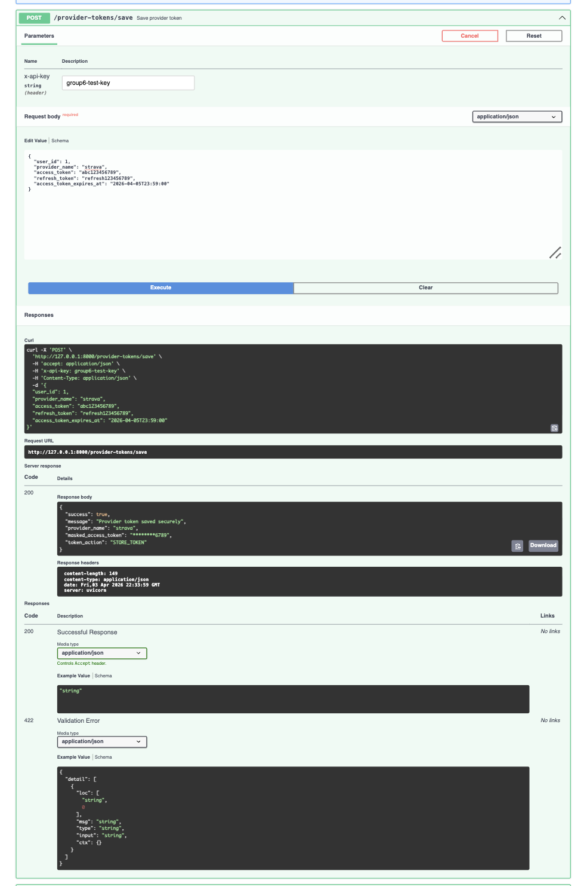
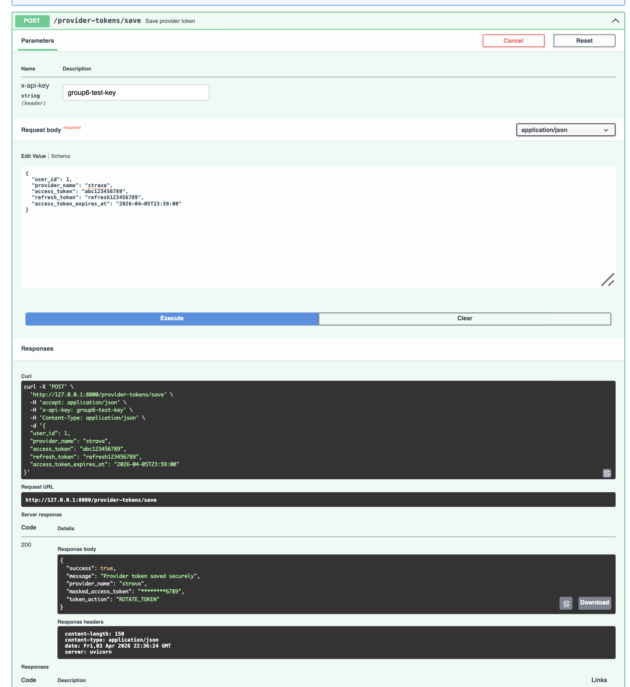
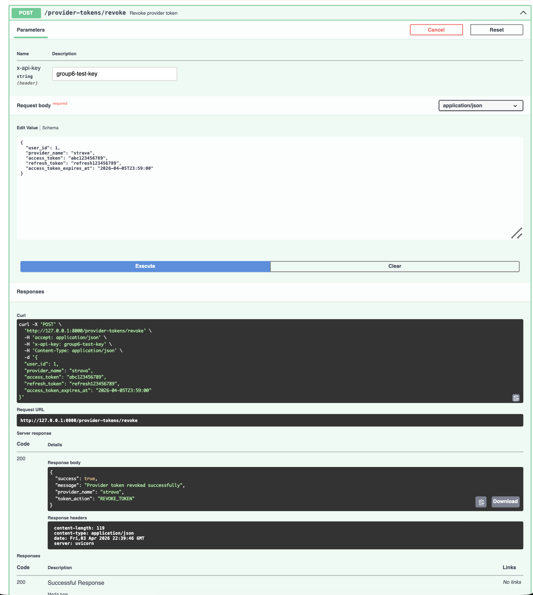
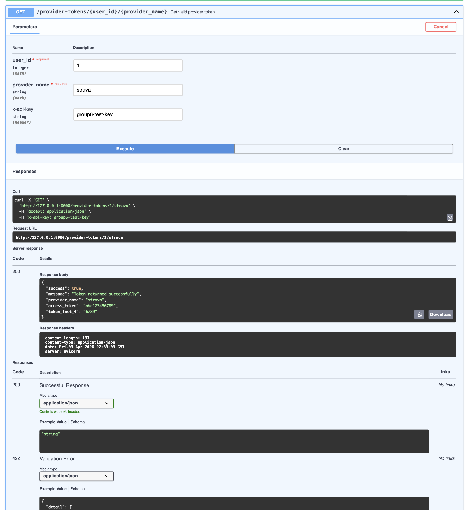
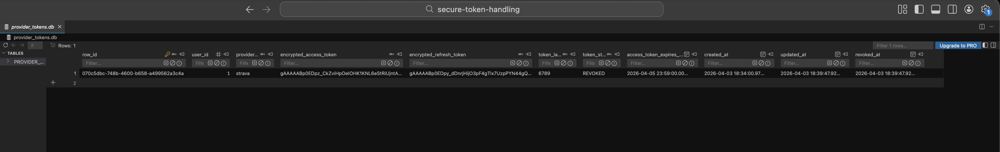
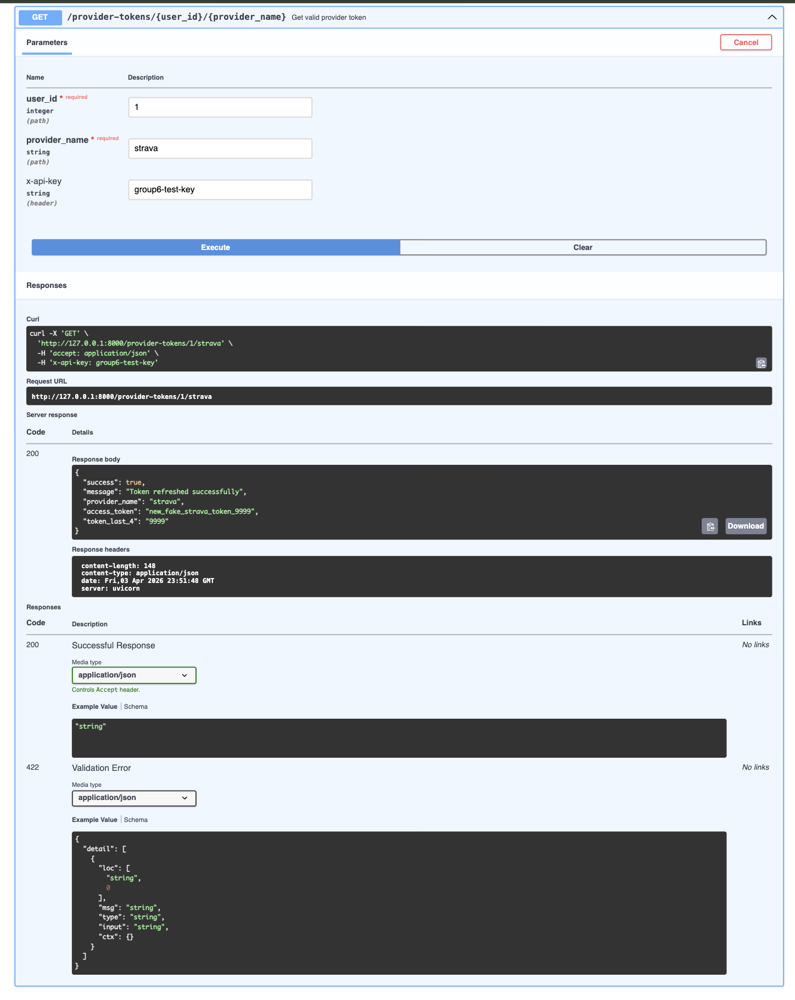

# Provider Token API

FastAPI service for securely storing, rotating, revoking, and retrieving provider access tokens.

It is designed to:

- store provider access tokens securely
- store refresh tokens when a provider supports them
- revoke provider tokens
- retrieve a valid token for backend use
- refresh expired tokens when refresh support exists

---

## What it does

When a token is saved:

- access tokens are encrypted with Fernet
- refresh tokens are encrypted when present
- only the last 4 characters are kept for display
- plaintext tokens are never stored in the database

When a token is retrieved:

- the API checks whether a token exists
- it rejects revoked tokens
- it checks expiration
- it refreshes the token if a refresh flow is available
- it returns a valid access token when possible

---

## Project structure

```text
secure-token-handling/
│
├── images/
│   ├── dummy_refresh_example.png
│   ├── get_valid_token_example.png
│   ├── revoke_example.png
│   ├── rotate_token_example.png
│   ├── save_token_part_example.png
│   └── sqlite_viewer_vscode.png
│
├── database.py
├── main.py
├── token_model.py
├── token_service.py
├── provider_tokens.db
├── requirements.txt
└── README.md
```

---

## Requirements

Install dependencies with:

```bash
pip install -r requirements.txt
```

Libraries used:

- fastapi
- uvicorn
- sqlalchemy
- cryptography
- python-dotenv
- requests

---

## Environment variables

Create a `.env` file in the project root:

```env
FERNET_KEY=your_generated_key
TEST_API_KEY=group6-test-key
USE_FAKE_REFRESH=false
```

Set `USE_FAKE_REFRESH=true` for local testing to simulate refresh-token success without calling real provider endpoints.

Optional values for real refresh-token support:

```env
STRAVA_CLIENT_ID=your_id
STRAVA_CLIENT_SECRET=your_secret
MAPMYRUN_CLIENT_ID=your_id
MAPMYRUN_CLIENT_SECRET=your_secret
```

### Generate a Fernet key

```bash
python3 -c "from cryptography.fernet import Fernet; print(Fernet.generate_key().decode())"
```

---

## Run the API

```bash
source venv/bin/activate
python3 main.py
```

If your virtual environment uses a different name, activate that environment instead.

Open Swagger UI at:

```text
http://127.0.0.1:8000/docs
```

You can also run it directly with Uvicorn:

```bash
uvicorn main:app --reload
```

---

## API key

Include this header on protected routes:

```text
x-api-key: group6-test-key
```

---

## Allowed providers

- strava
- mapmyrun
- weski
- mywhoosh

All four providers are accepted by the API, but refresh-token support is only implemented for `strava` and `mapmyrun` right now.

---

## Routes overview

| Method | Route                                        | Purpose                         |
| ------ | -------------------------------------------- | ------------------------------- |
| GET    | `/`                                          | API Status                      |
| POST   | `/provider-tokens/save`                      | Save or rotate a provider token |
| POST   | `/provider-tokens/revoke`                    | Revoke a provider token         |
| GET    | `/provider-tokens/{user_id}/{provider_name}` | Retrieve a valid token          |

---

## API Status

### `GET /`

Response:

```json
{
  "message": "Provider token API is running"
}
```

---

## Save token

### `POST /provider-tokens/save`

Request body:

```json
{
  "user_id": 1,
  "provider_name": "strava",
  "access_token": "abc123456789",
  "refresh_token": "refresh123456789",
  "access_token_expires_at": "2026-04-05T23:59:00"
}
```

### First save

```json
{
  "success": true,
  "message": "Provider token saved securely",
  "provider_name": "strava",
  "masked_access_token": "********6789",
  "token_action": "STORE_TOKEN"
}
```



### Saving the same user/provider again

If a record already exists for the same `user_id` and `provider_name`, the API rotates the token instead of creating a duplicate.

```json
{
  "token_action": "ROTATE_TOKEN"
}
```



---

## Revoke token

### `POST /provider-tokens/revoke`

Request body:

```json
{
  "user_id": 1,
  "provider_name": "strava"
}
```

Response:

```json
{
  "success": true,
  "message": "Provider token revoked successfully",
  "provider_name": "strava",
  "token_action": "REVOKE_TOKEN"
}
```

If the token is already revoked or does not exist, the API returns a success response with:

```json
{
  "message": "No active provider token to revoke"
}
```



---

## Get a valid token

### `GET /provider-tokens/{user_id}/{provider_name}`

Example:

```text
GET /provider-tokens/1/strava
```

### Success response

```json
{
  "success": true,
  "message": "Token returned successfully",
  "provider_name": "strava",
  "access_token": "abc123456789",
  "token_last_4": "6789"
}
```

### If the token was refreshed

```json
{
  "success": true,
  "message": "Token refreshed successfully",
  "provider_name": "strava",
  "access_token": "new_access_token",
  "token_last_4": "6789"
}
```

### If the token is revoked

```json
{
  "success": false,
  "message": "Provider token is revoked",
  "provider_name": "strava"
}
```



---

## Database

The app uses SQLite:

```text
provider_tokens.db
```

Stored fields include:

- encrypted access token
- encrypted refresh token
- token status
- token expiry
- created and updated timestamps
- revocation timestamp



---

## Refresh-token support

The API can refresh expired tokens when the provider supports it.

Implemented:

- `strava`
- `mapmyrun`

Placeholders for future work:

- `weski`
- `mywhoosh`

Refresh-token docs for `weski` and `mywhoosh` were not found yet, so their refresh flows are still placeholders.

If `USE_FAKE_REFRESH=true`, refresh calls for `strava` and `mapmyrun` are simulated for testing.

### Dummy refresh example (`USE_FAKE_REFRESH=true`)



If `USE_FAKE_REFRESH=false` and refresh credentials are not configured in `.env`, refresh attempts will fail and the API will return `Token refresh failed`.

---

## Suggested testing flow

1. `GET /`
2. `POST /provider-tokens/save`
3. `POST /provider-tokens/save` again for the same user/provider to confirm `ROTATE_TOKEN`
4. `GET /provider-tokens/{user_id}/{provider_name}`
5. `POST /provider-tokens/revoke`
6. `GET /provider-tokens/{user_id}/{provider_name}` again to confirm the revoked-token behavior

---

## Design References

This project’s token manager structure was informed by:

- [Amir Doustdar, _Building a Secure FastAPI Client: A Practical Guide to Token Refresh and Authentication_](https://medium.com/@amirrdoustdar1/building-a-secure-fastapi-client-a-practical-guide-to-token-refresh-and-authentication-cab2820cc418)
- [Bhagyarana80, _FastAPI Refresh Tokens: Securely Manage User Sessions Beyond Expiry_](https://medium.com/@bhagyarana80/fastapi-refresh-tokens-securely-manage-user-sessions-beyond-expiry-9f937cfb59c0)

The implementation also followed official documentation for the libraries used in the project:

- [FastAPI docs](https://fastapi.tiangolo.com/)
- [Pydantic docs](https://docs.pydantic.dev/)
- [SQLAlchemy docs](https://docs.sqlalchemy.org/)
- [cryptography Fernet docs](https://cryptography.io/en/latest/fernet/)
- [Requests docs](https://requests.readthedocs.io/)
- [SQLite docs](https://www.sqlite.org/docs.html)

The following ideas were adapted from those references:

- manager-based token handling structure
- expiry check logic
- refresh flow structure
- get-valid-token flow

This project applies those ideas to a database-backed provider token system rather than in-memory session tokens.

---

## Integration Considerations

- Use stronger authentication instead of one shared `TEST_API_KEY` (for example: JWT or gateway auth).
- Keep secrets in a secure place and rotate keys regularly.
- Keep `USE_FAKE_REFRESH=false` outside local testing.
- Add real refresh support for `weski` and `mywhoosh` before full integration.
- Return consistent HTTP status codes and error responses.
- Replace simple print logging with proper persistent logs and monitoring.
- Add automated tests for save, rotate, revoke, refresh, and failure cases.

---

## Notes

- Tokens are encrypted using Fernet.
- Only masked token values are returned in save responses.
- The GET route returns the decrypted access token for backend use.
- `ROTATE_TOKEN` means an existing token was replaced.
- `REVOKE_TOKEN` means a token was disabled.
- `USE_FAKE_REFRESH` should only be used in local testing.
- Audit logging is currently a placeholder for future work (related to Feature#38)
