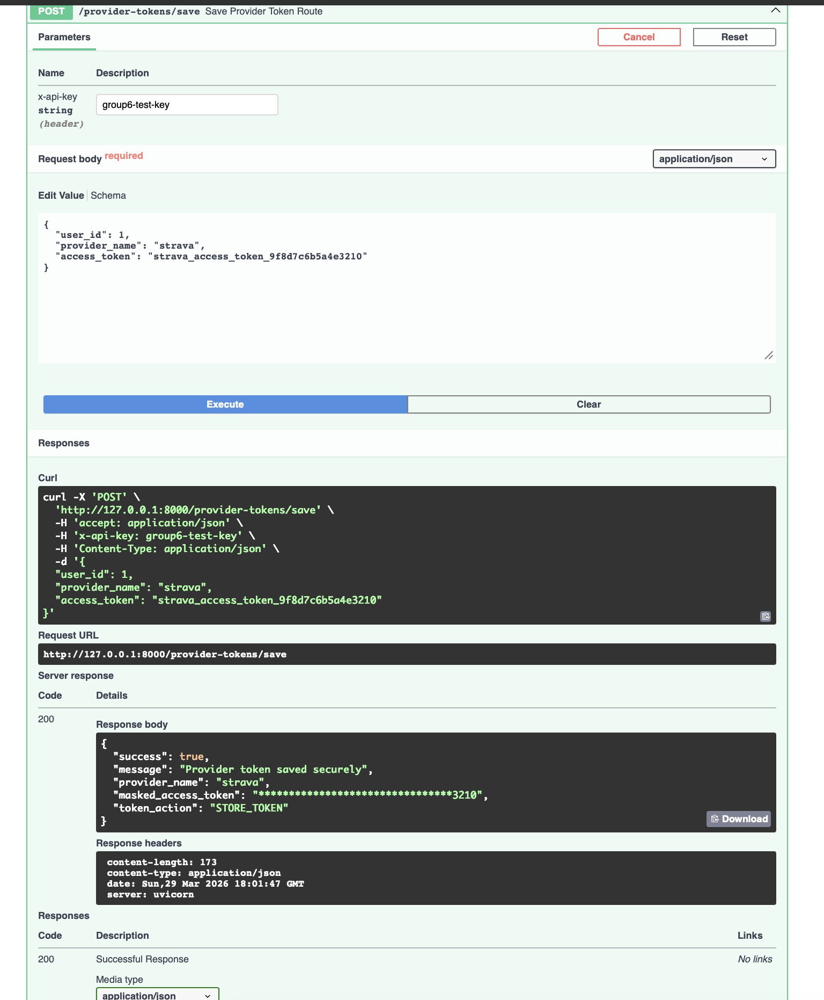
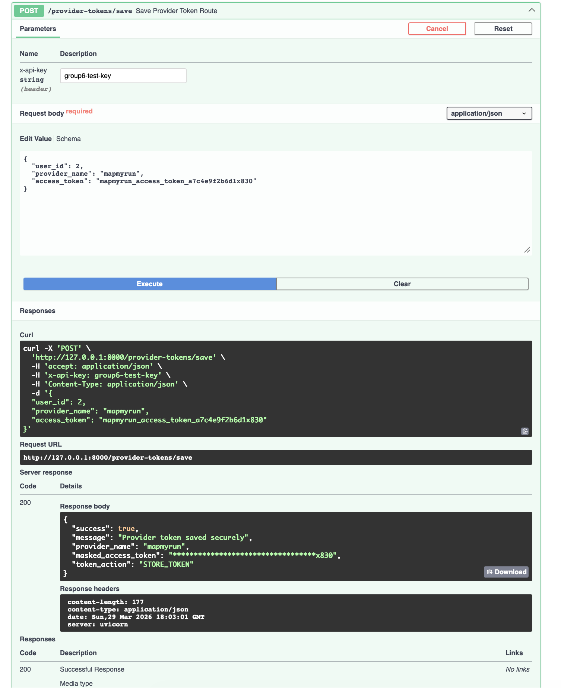
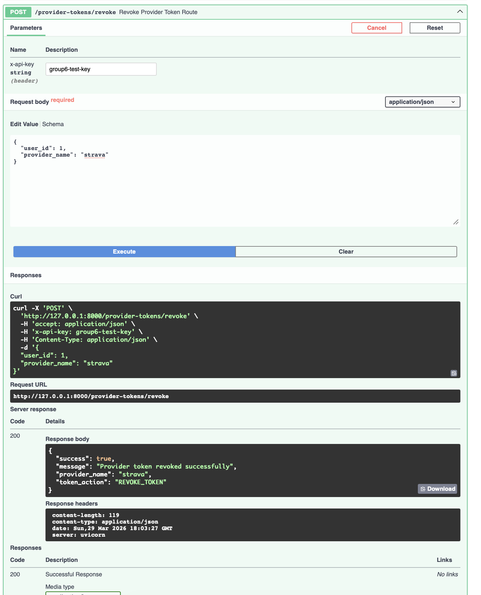

# Provider Token API

This project is a small FastAPI API that saves and revokes provider access tokens in a more secure way.

## What does it do

This API lets a user save a provider token and revoke it later.  
When saving a token, the token is encrypted before it is stored in the database.  
When returning a response, the token is masked so the full token is not shown.

## Requirements

Install the libraries in `requirements.txt` first:

`pip install -r requirements.txt`

The project uses:

- `fastapi`
- `uvicorn`
- `sqlalchemy`
- `cryptography`
- `pydantic`
- `python-dotenv`

## Environment file

Create a `.env` file in the project folder.

Your `.env` file should look like this:

```env
FERNET_KEY=your_generated_fernet_key_here
TEST_API_KEY=group6-test-key
```

### How to generate the Fernet key

Run this in the terminal:

`python3 -c "from cryptography.fernet import Fernet; print(Fernet.generate_key().decode())"`

Then copy the generated key into the `.env` file.

## How to run it

Activate the virtual environment first:

`source venv/bin/activate`

Then run:

`python3 main.py`

On some computers, this may also work:

`python main.py`

## Swagger UI

To test the API in Swagger, go to:

`http://127.0.0.1:8000/docs`

## Test API key

This project uses a temporary API key check so only authorized users can use the save and revoke routes.

For Swagger, use this:

`x-api-key: group6-test-key`

## Allowed providers

Only these providers are allowed:

- `strava`
- `mapmyrun`
- `weski`
- `mywhoosh`

## Routes

### `GET /`

This just checks if the API is running.

Example response:

`{"message": "Provider token API is running"}`

### `POST /provider-tokens/save`

This route saves a provider token securely.

Example request body for Strava:

```json
{
  "user_id": 1,
  "provider_name": "strava",
  "access_token": "strava_access_token_9f8d7c6b5a4e3210"
}
```

Example request body for MapMyRun:

```json
{
  "user_id": 2,
  "provider_name": "mapmyrun",
  "access_token": "mapmyrun_access_token_a7c4e9f2b6d1x830"
}
```





### `POST /provider-tokens/revoke`

This route revokes a provider token.

Example request body for Strava:

```json
{
  "user_id": 1,
  "provider_name": "strava"
}
```

Example request body for MapMyRun:

```json
{
  "user_id": 2,
  "provider_name": "mapmyrun"
}
```



## Database

This project uses SQLite.

The database file is:

`provider_tokens.db`

If using VS Code, you can use a SQLite Viewer extension to see the database in a cleaner way.


## Extra notes

- The token is encrypted before being stored in the database.
- The response only shows a masked version of the token.
- The API key right now is only for testing.
- `ROTATE_TOKEN` means an existing token was replaced with a new encrypted token for the same user and provider.
- `record_token_event()` is related to audit logging, but right now it is only a simple placeholder and just prints to the terminal. This part is related to Feature #38.
