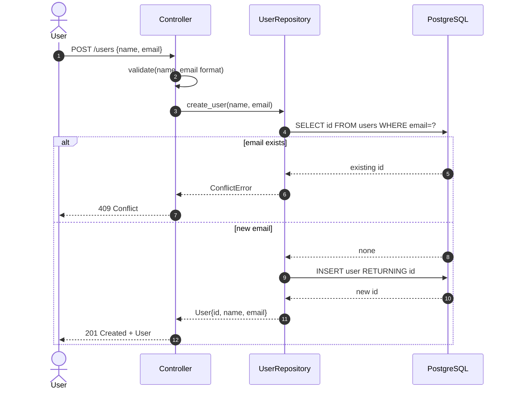
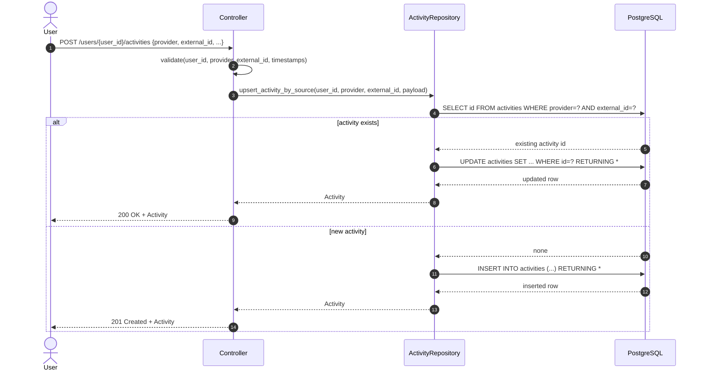
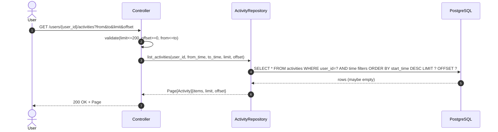

# Group 11 – Sequence Diagrams (Checkpoint 2)

These are design-level sequence diagrams for Group 11 (Persistence & Data Access Layer).
All diagrams follow: User → Controller → Repository → Database.

---

## 1) Create User


## 2) Upsert Activity

## 3) List Activities (Pagination)

## 4) Create Goal
```mermaid
sequenceDiagram
  autonumber
  actor User
  participant Controller
  participant Repo as GoalRepository
  participant DB as PostgreSQL

  User->>Controller: POST /users/{user_id}/goals {type, target_value, period_start}
  Controller->>Controller: validate(type, target_value>0, period_start)
  Controller->>Repo: create_goal(user_id, payload)

  Repo->>DB: INSERT INTO goals (...) RETURNING *
  alt invalid user_id (FK fails)
    DB-->>Repo: FK violation error
    Repo-->>Controller: NotFoundError or ValidationError
    Controller-->>User: 400/404
  else success
    DB-->>Repo: inserted row
    Repo-->>Controller: Goal
    Controller-->>User: 201 Created + Goal
  end


